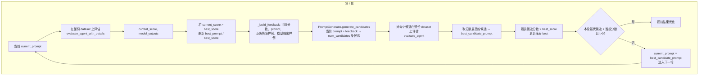
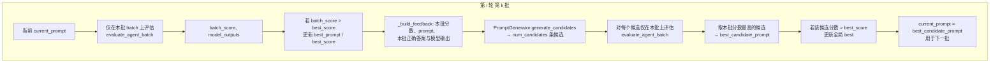

# APO 优化框架

基于 APO (Automatic Prompt Optimization) 的系统提示词优化：算法接受一个 **`(input_data, system_prompt) -> output`** 的函数与数据集，迭代搜索更优的 `system_prompt`。

---

## 算法接口

- **唯一依赖**：可调用对象 **rollout**，签名为 `(input_data, system_prompt) -> output`。  
  算法内部只做：对每条样本调用 `rollout(item["input"], current_prompt)` 得到模型输出，再与标准答案一起做评估。不关心 rollout 内部如何实现（是否用 Agent、是否用 LLM 等）。
- **数据集**：`list[dict]`，每条必须包含 `"input"` 和 `"output"`。  
  - `input`：传给 rollout 的输入。  
  - `output`：标准答案，用于与 rollout 的输出一起送入评估模板打分。

---

## 算法详细流程图

### 总览：optimize 入口与模式分支

```mermaid
flowchart TD
    A[optimize(initial_prompt, ...)] --> B[current_prompt = initial_prompt<br/>best = initial_prompt]
    B --> C{update_per_batch?}
    C -->|False| D[全数据集模式<br/>_optimize_full_dataset]
    C -->|True| E[Mini-batch 模式<br/>_optimize_mini_batch]
    D --> F[返回 best_prompt, best_score, history]
    E --> F
```

### 单次「评估」内部（Evaluator）

对给定 `prompt` 在若干条数据上算平均分：每条先 rollout 得输出，再与标准答案一起交给 reward 模板 + LLM 打 0~1 分，最后求平均。

```mermaid
flowchart LR
    subgraph 评估一条
        I[item: input + output] --> R[rollout(input, prompt)]
        R --> O[模型输出]
        O --> T[reward 模板<br/>prediction=O, true_label=item.output]
        T --> LLM1[LLM 打分 0~1]
    end
    subgraph 批内
        LLM1 --> AVG[批内平均 → score]
    end
```

### 全数据集模式：单轮迭代



### Mini-batch 模式：单轮内的一批

每轮先 shuffle（若开启），再按 `batch_size` 切批；**每一批**内流程如下，批间用上一批得到的 `current_prompt` 衔接。



Mini-batch 的**轮级**：每轮所有批跑完后，若本轮没有任何批带来全局 best 的更新且 `i > 0`，则提前结束；否则进入下一轮（重新 shuffle 再按批处理）。

---

## 算法流程（文字）

1. **评估**
   对给定 `current_prompt`，在（全量或当前批）数据上对每条调用 `rollout(item["input"], current_prompt)`，得到模型输出；将「模型输出」与「item["output"]」填入 **reward 模板**（如 `reward.txt`），用 LLM 打 0~1 分；批内取平均作为当前 prompt 的分数。

2. **反馈与候选生成**  
   用当前分数、当前 prompt、数据中的正确答案样例、模型输出样例拼成 **feedback**，交给 **PromptGenerator**；由 LLM 根据当前 prompt + feedback 生成若干条 **候选 prompt**（数量由 `num_candidates` 控制）。

3. **候选评估与更新**  
   对每个候选 prompt 在（全量或当前批）数据上同样通过 rollout 评估得分；取分数最高的候选作为下一轮的 `current_prompt`，并据此更新全局最优 prompt 与分数。

4. **迭代与模式**  
   - **全数据集模式**（`update_per_batch=False`）：每轮在整份数据集上评估当前 prompt、生成候选、再在整份数据上评估所有候选，取最优进入下一轮。  
   - **Mini-batch 模式**（`update_per_batch=True`）：每轮按 `batch_size` 切批；每批内对当前 prompt 评估 → 生成候选 → 仅在该批上评估候选 → 用该批最优更新 current_prompt，并更新全局最优。  
   可配置 `num_iterations`、`shuffle`、`max_workers`（并发数）等；若某轮（全量或批内）无提升且非首轮，可提前结束。

---

## 模块与数据

- **APOOptimizerAgent**：入口。构造时传入 `rollout`、`dataset`、LLM 配置、`reward_prompt_path`；`optimize(initial_prompt, num_iterations, num_candidates, batch_size, shuffle, update_per_batch, max_workers)` 返回 `(best_prompt, best_score, history)`。
- **AgentEvaluator**：封装「对 rollout 在给定 prompt 下的调用 + reward 模板 + LLM 打分」，支持按批、并发。
- **PromptGenerator**：根据当前 prompt 与 feedback 调用 LLM 生成多条候选提示词（解析 `PROMPT:` 前缀）。
- **数据集**：`load_dataset_from_json(path)` 得到 `list[dict]`，每条 `{"input": ..., "output": ...}`；`input`/`output` 类型与 rollout 及 reward 模板约定一致即可。

Reward 模板中占位符 `{prediction}`、`{true_label}` 对应「模型输出」与「item["output"]」；LLM 返回的 JSON 需包含 `score`（0~1）。

---

## 使用方式

调用方提供符合签名的 **rollout** 即可，无需固定 Agent 形态。例如：

```python
def rollout(input_data, system_prompt):
    # 任意实现：例如设置某 agent 的 system_prompt 后调用其处理函数
    agent.system_prompt = system_prompt
    return agent._process(input_data)

optimizer = APOOptimizerAgent(rollout=rollout, dataset=dataset, llm_model_name=..., api_key=..., base_url=..., reward_prompt_path="reward.txt")

best_prompt, best_score, history = optimizer.optimize(initial_prompt=..., num_iterations=5, num_candidates=3, ...)
```

项目中的 `train.py`、`bin/main_agent.py` 仅为示例：如何实例化 Agent 并包成上述 rollout，以及如何调用 `optimize`。

---

## 项目结构

```
├── apo_optimizer_agent.py   # 优化器：接收 rollout + dataset，实现 APO 循环
├── evaluator_agent.py       # 评估器：rollout + reward 模板 + LLM 打分
├── prompt_generator.py      # 候选提示词生成
├── dataset.py               # load_dataset_from_json
├── reward.txt / cargo_reward.txt   # 评估用 reward 模板
├── train.py                 # 货运任务示例
├── cargo_agent.py           # 货运 Agent 示例
├── bin/
│   ├── main_agent.py        # 问答任务示例
│   └── qa_agent.py          # 问答 Agent 示例
└── data/                    # 示例数据
```

---

## 运行示例

```bash
export APO_API_KEY="your-api-key"
python train.py              # 货运
python bin/main_agent.py     # 问答（视路径配置）
```

算法侧不依赖具体 Agent；只要传入的 rollout 满足 `(input_data, system_prompt) -> output` 且数据集与 reward 模板格式一致即可。
